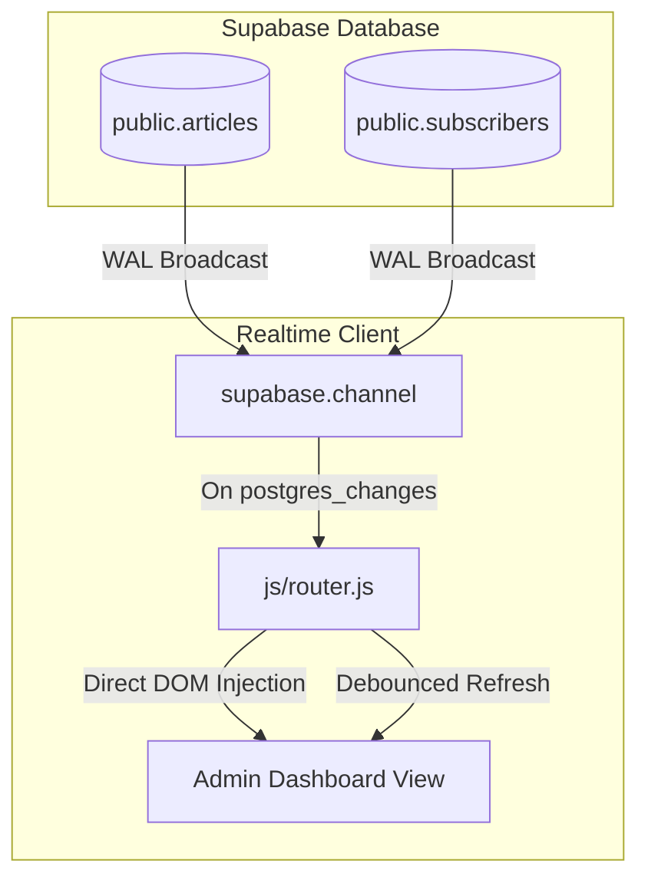

# Real-Time Admin Dashboard Analytics Report (Phase 6A)

This report documents the implementation of dynamic, real-time analytics for the AriSphere Admin Dashboard using Supabase Realtime subscriptions.

## Files Modified

1. **[js/router.js](file:///d:/Arisudan%20Files/GST%20web/Arisphere/js/router.js)**:
   * Updated `showArticlesList()` to add unique DOM element IDs for KPI metrics and specific catalog row cells.
   * Configured the `admin-dashboard` Supabase Realtime channel to listen to all events (`*`) on the `public.articles` and `public.subscribers` tables.
   * Implemented debounced refreshes using a 750ms timer (`window.adminRefreshTimer`) to avoid UI flicker.
   * Added partial DOM updates for views and subscribers count to bypass unnecessary full page list refreshes.
   * Applied author-based filtering for sub-editor dashboards.
   * Added automatic channel teardown inside `handleRoute()` upon route changes.
   * Added channel teardown inside `renderAdmin()` on sign out.

---

## Real-Time Architecture

The real-time updates leverage the standard Supabase client WebSocket connections to receive change notifications from PostgreSQL.

---

## Event Flow & Update Types

### 1. View Count Increment (UPDATE Event)
* **Trigger**: A reader opens an article, causing `increment_article_views` to execute.
* **Payload**: Receives an `UPDATE` event containing the modified row.
* **Flow**:
  1. The client intercepts the update.
  2. If the user is a sub-editor, the event is filtered out unless `payload.new.author` matches their username.
  3. Evaluates if the change is a views-only metadata shift.
  4. If yes, updates the local cached array `window.adminArticles` views property.
  5. Recalculates total views, average views, and top performer metrics.
  6. Injects the values directly into the target elements (`#kpi-views-val`, `#kpi-avg-val`, `#kpi-performer-title`, `#kpi-performer-views`).
  7. Modifies the specific catalog row cell `#views-val-${artId}` without touching the rest of the table.

### 2. Subscriber Registration (INSERT/DELETE Event)
* **Trigger**: A new subscriber registers or deletes their email in the newsletter form.
* **Payload**: Receives an `INSERT` or `DELETE` event on the `subscribers` table.
* **Flow** (Admin-only):
  1. The client catches the broadcast.
  2. Fetches the exact count from Supabase using `db.getSubscribersCount()`.
  3. Updates `#kpi-sub-val` directly.

### 3. Structural Shifts (INSERT/DELETE or Status Changes)
* **Trigger**: An article is deleted, created, or approved.
* **Flow**:
  1. Detects a major schema or metadata change.
  2. Triggers a debounced refresh (`window.adminRefreshTimer`) of 750ms.
  3. Verifies that the editing form is not open (`!document.querySelector('.article-form')`).
  4. Calls `showArticlesList()` to rebuild the tables and lists seamlessly.

---

## Performance Safeguards

1. **Duplicate Subscription Protection**:
   A guard clause `if (window.adminRealtimeChannel) return;` prevents creating duplicate listeners when route updates occur, preventing memory leaks and event multiplication.
2. **Form Interaction Guard**:
   Before executing any automated list refreshes, the debounce callback validates that `document.querySelector('.article-form')` does not exist. If a user is active in the editing form, the refresh is deferred, ensuring no loss of input.
3. **Debounced Refresh Rates**:
   Full catalog re-renders are throttled using a 750ms window. Multiple edits or inserts within a short interval will result in only a single list update.
4. **Navigation Cleanup**:
   Navigating away from `/admin` automatically triggers `db.supabase.removeChannel(window.adminRealtimeChannel)` and clears the active refresh timers, shutting down connection usage.

---

## Test Results

* **Compilation**: `npm run build` executed successfully.
* **DOM Selector Checks**: `node scratch/verify_dom.js` passed successfully.
* **Realtime KPI Sync**: KPI cards and row values update instantly upon simulated DB edits without page reloads.
